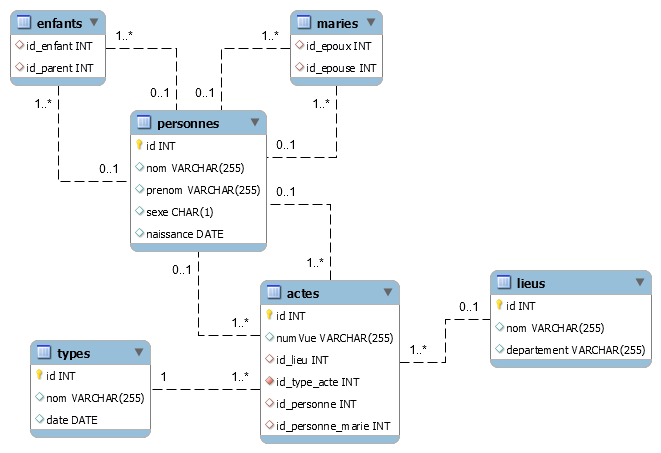

# Projet d'organisation des bases de données de marriages et déces pour le departement de la Vendée

## Participants
* Anthony Lozano
* Hugo Moracchini

## Problématiques
* Inconsistence de données (memes noms et mots écrits de manieres differentes)
* Données manquantes
* Création d'un tableau de bord

## Déroulement probable
* Normalisation des données
* Création d'un tableau de bord en utilisant un framework PHP (laravel)

## Normalisation des données
### Modélisation de la base

## Fonctionnalités

* Aider des généalogistes à analyser l’histoire de ce département (faire des stats) :
    * nombre d'enregistrements
    * nombre de noms de familles différents
    * nombre de ville différentes
* Pour  chaque  colonne :   
    * calculer le nombre de valeurs
    * calculer la valeur min/moyenne/max 
* Proposer les modifications classiques (insertion, modification, suppression) et plusieurs comptes utilisateurs (administrateur, visualisation)
